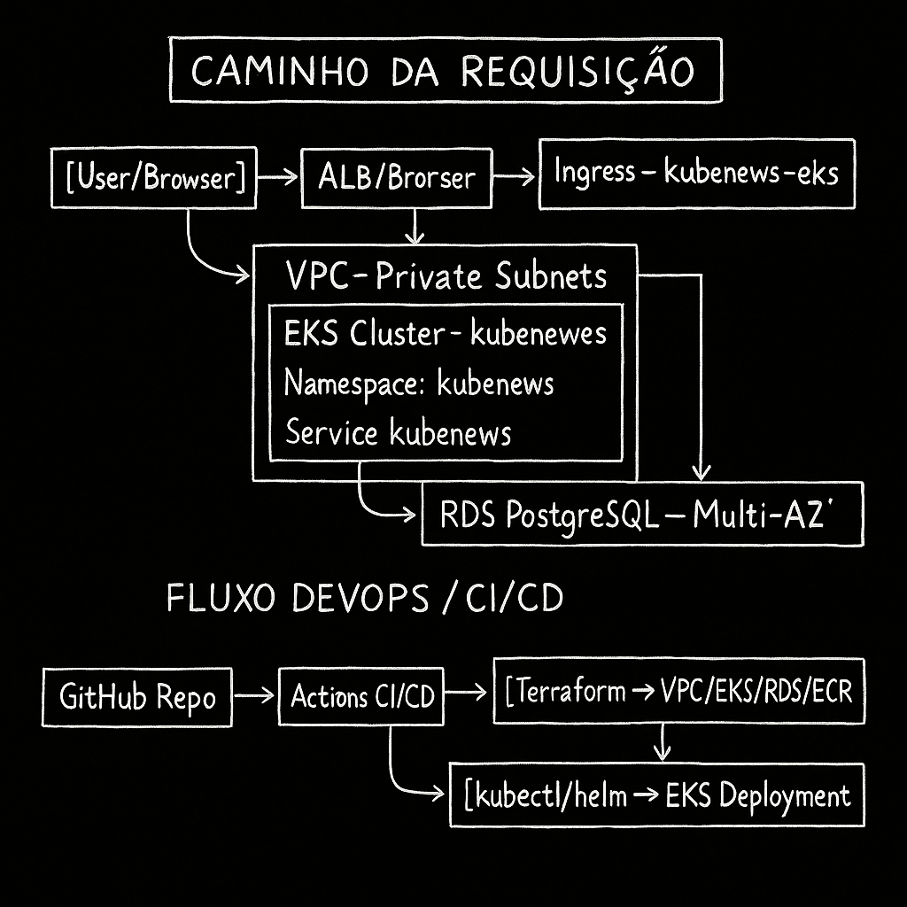

# Kube-News – Plataforma Cloud-Native em AWS com EKS, RDS e CI/CD

<p align="center">
  
</p>

> 🧰 **Stack Principal:** AWS · VPC · Amazon EKS · Amazon RDS · Amazon ECR · ALB (AWS Load Balancer Controller) · Terraform · Kubernetes · Docker · Docker Compose · kind · GitHub Actions · OIDC · Kustomize · Node.js · Express · PostgreSQL

Kube-News é uma aplicação de notícias em Node.js usada como base para demonstrar uma arquitetura **cloud-native completa** em AWS, com:

- Infraestrutura como código (Terraform)
- Kubernetes gerenciado (Amazon EKS)
- Banco gerenciado (Amazon RDS PostgreSQL)
- Registro de imagens (Amazon ECR)
- Ingress com AWS Load Balancer Controller (ALB)
- Pipeline CI/CD com GitHub Actions e OIDC

Este README tem foco “enterprise”: explica **a arquitetura**, **as decisões de projeto** e **o passo a passo** para subir o ambiente.

---

## 📚 Visão Geral da Arquitetura

### Componentes principais

- **Aplicação**

  - Node.js + Express + EJS
  - Conecta em PostgreSQL
  - Exposta via Service + Ingress no EKS

- **Infra de Rede (Network)**

  - VPC dedicada
  - Subnets públicas (ALB) e privadas (EKS + RDS)
  - NAT Gateway e tabelas de rota

- **Plataforma (Platform)**

  - Amazon EKS cluster + node groups
  - Amazon ECR para as imagens do backend
  - OIDC para:
    - GitHub Actions assumir role na AWS
    - AWS Load Balancer Controller
  - Helm deployment do AWS Load Balancer Controller

- **Dados (RDS)**

  - Amazon RDS PostgreSQL em subnets privadas
  - Security Group dedicado para o banco

- **Kubernetes Manifests**

  - Namespace da aplicação
  - Deployment + Service
  - Secret com configuração de banco
  - Ingress com ALB + healthchecks

- **CI/CD (GitHub Actions)**
  - Build/push da imagem para ECR
  - Atualização automática do `kustomization.yaml` com a nova tag da imagem
  - Uso de OIDC (sem Access Key fixa)

---

## 🧱 Diagrama Lógico de Arquitetura

Você pode visualizar a arquitetura de duas formas:

1. **Imagem**: `docs/architecture-kubenews.png`
2. **Mermaid (renderizável no GitHub)**:

```mermaid
flowchart LR
    User[Usuário na Internet] --> ALB[ALB - Ingress\n(AWS Load Balancer Controller)]
    ALB --> EKSNodes[Amazon EKS\nNós do Cluster]
    EKSNodes --> AppPods[Pods da Aplicação\nDeployment Kube-News]

    AppPods -->|conexão TCP 5432| RDS[(Amazon RDS\nPostgreSQL)]

    subgraph VPC[VPC Kube-News]
      subgraph Public[Subnets Públicas]
        ALB
      end

      subgraph Private[Subnets Privadas]
        EKSNodes
        RDS
      end
    end
```

**Fluxo resumido:**

1. O usuário acessa o ALB (HTTP/HTTPS).
2. O ALB encaminha o tráfego para o Ingress no EKS.
3. O Ingress rota para o Service da aplicação.
4. O Service distribui para os Pods do Kube-News.
5. Os Pods acessam o banco PostgreSQL no RDS em subnets privadas.

---

## 📁 Estrutura do Repositório

```bash
/
├── APP/                             # Código da aplicação
│   └── frontend/
│       └── src/
│           ├── Dockerfile           # Imagem de produção do Kube-News
│           ├── compose.yml          # Ambiente local com Docker Compose
│           ├── kind-config.yaml     # Configuração de cluster kind local
│           ├── server.js            # App Express principal
│           ├── system-life.js       # Health checks e métricas
│           ├── models/
│           ├── views/
│           └── static/
│
├── kubernetes/                      # Manifests e Kustomize
│   ├── namespace.yaml
│   ├── secret-db.yaml               # Configuração de DB (password deve ser tratada com cuidado)
│   ├── Frontend/
│   │   ├── deployment-app.yaml
│   │   └── service-app.yaml
│   ├── ingress.yaml                 # Ingress para ALB
│   └── kustomization.yaml           # Entry point Kustomize
│
├── networking/                      # Terraform - Rede (VPC, subnets, rotas, NAT, IGW)
│   ├── main.tf
│   ├── variables.tf
│   ├── outputs.tf
│   ├── vpc.tf
│   ├── vpc.public-subnet.tf
│   ├── vpc.private-subnet.tf
│   ├── vpc.public-route-table.tf
│   ├── vpc.private-route-table.tf
│   ├── vpc.igw.tf
│   └── vpc.nat-gateway.tf
│
├── platform/                        # Terraform - Plataforma (EKS, ECR, OIDC, LB Controller)
│   ├── main.tf
│   ├── variables.tf
│   ├── outputs.tf
│   ├── data.vpc.tf
│   ├── data.private-subenets.tf
│   ├── eks.cluster.iam.tf
│   ├── eks.cluster.node-group.iam.tf
│   ├── eks.cluster.node-group.tf
│   ├── eks.cluster.tf
│   ├── iam.eks.oidc.tf
│   ├── iam.oidc.github.tf
│   ├── ecr.repositories.tf
│   └── helm.lb-controller.tf
│
├── rds/                             # Terraform - Banco de dados PostgreSQL
│   ├── main.tf
│   ├── variables.tf
│   ├── outputs.tf
│   ├── data.vpc.tf
│   ├── data.private-subenets.tf
│   ├── db-postgre.tf
│   └── sg-db-postgre.tf
│
├── remote-state-backend/            # Terraform - Backend de estado remoto
│   ├── main.tf
│   ├── variables.tf
│   ├── outputs.tf
│   └── s3-remote-state-bucket.tf
│
├── .github/
│   └── workflows/
│       └── application.pipeline.yaml # Pipeline CI/CD (ECR + Kustomize)
│
└── docs/
    └── architecture-kubenews.png    # Diagrama de arquitetura
```

---

## ⚙️ Decisões de Arquitetura e Boas Práticas

Esta seção resume os pontos de maturidade do projeto e as melhorias que a arquitetura entrega.

### 1. Organização e Separação de Responsabilidades

- **Antes**: app + alguns manifests, foco em “fazer rodar”.
- **Agora**: repositório organizado como uma **plataforma**:
  - `APP/` → código da aplicação
  - `networking/` → rede base (VPC, subnets, NAT)
  - `platform/` → EKS, ECR, OIDC, LB Controller
  - `rds/` → RDS PostgreSQL
  - `remote-state-backend/` → state remoto do Terraform
  - `kubernetes/` → manifests de runtime

✅ Isso segue práticas de **separação de domínios** e facilita evoluir para multi-conta/multi-ambiente.

---

### 2. Performance e Eficiência

**Dockerfile da aplicação (`APP/frontend/src/Dockerfile`)**:

- Base `node:20-alpine` → imagem leve
- Uso de `npm ci --omit=dev` quando `package-lock.json` existe:
  - Instalação mais rápida e reprodutível
  - Imagem menor (sem `devDependencies`)
- `NODE_ENV=production`
- Processo rodando como usuário não-root (`USER app`)

No Kubernetes:

- Deployment com `resources.requests` e `limits`
- `livenessProbe` e `readinessProbe` configurados
- Banco de dados fora do cluster (RDS) → reduz carga no cluster e facilita escalar app e banco separadamente.

✅ Foco em **eficiência de recursos**, **startup consistente** e **comportamento saudável sob carga**.

---

### 3. Segurança

- **Imagens**:

  - Repositório ECR com:
    - `image_scanning_configuration { scan_on_push = true }`
    - `encryption_configuration { encryption_type = "AES256" }`

- **Runtime**:

  - Containers rodam como usuário não-root
  - EKS e RDS em subnets privadas
  - ALB em subnets públicas controladas

- **Acesso AWS**:
  - Uso de **OIDC** para:
    - GitHub Actions (assume role via `aws-actions/configure-aws-credentials`)
    - AWS Load Balancer Controller
  - Não há necessidade de Access Key/Secret Key no pipeline

> ⚠️ **Importante:** As senhas e segredos em `secret-db.yaml` e variáveis sensíveis do Terraform devem ser tratados em produção com:
>
> - AWS Secrets Manager ou SSM Parameter Store
> - Variáveis Terraform `sensitive = true`
> - Integração com CSI driver ou injeção de env a partir de secret managers

---

### 4. CI/CD e Automação

Pipeline em `.github/workflows/application.pipeline.yaml`:

- Gatilhos: `push` na `main` + `workflow_dispatch`
- Permissões:
  - `id-token: write`
  - `contents: write`
- Etapas principais:
  1. Checkout do código
  2. Configuração de credenciais AWS via OIDC
  3. Login no ECR
  4. Build/push da imagem do Kube-News
  5. Instalação do `kustomize`
  6. Atualização de `kubernetes/kustomization.yaml` com a nova tag:
     ```bash
     cd kubernetes
     kustomize edit set image $REGISTRY/$ECR_REPOSITORY=$REGISTRY/$ECR_REPOSITORY:$IMAGE_TAG
     git add kustomization.yaml
     git commit -m "[BOT] Updating image to $REGISTRY/$ECR_REPOSITORY:$IMAGE_TAG"
     git push
     ```

✅ Isso mostra um fluxo **GitOps-friendly**: a imagem nova é publicada e a referência dela nos manifests é versionada no Git.

---

### 5. Maturidade / Senioridade do Projeto (Notas de Arquitetura)

Este projeto demonstra:

- Uso de **Infra as Code** moderno (Terraform com state remoto, assume_role, tags globais)
- Entendimento de:
  - Redes em cloud (VPC, subnets públicas/privadas, NAT)
  - Orquestração de containers (EKS) e integração com ALB
  - Banco gerenciado (RDS) adequado para produção
  - Pipelines com OIDC (sem credenciais estáticas)
- Organização do repositório alinhada com times de **plataforma** de grandes empresas

👉 Em termos de maturidade, o projeto sai de um nível “app com alguns YAMLs” para uma **plataforma cloud-native coerente**, pronta para servir de base em um portfólio de engenheiro DevOps/Cloud.

---

## 🧪 Ambientes de Execução

### 1. Ambiente Local (Docker Compose)

Pasta: `APP/frontend/src/`

```bash
cd APP/frontend/src
docker compose up -d
```

- Sobe:
  - App Kube-News
  - PostgreSQL (imagem `postgres:15-alpine`)
- Usa variáveis com defaults sensatos (`POSTGRES_USER`, `POSTGRES_PASSWORD`, etc.)

---

### 2. Cluster Local (kind) – opcional

Na mesma pasta:

```bash
cd APP/frontend/src
kind create cluster --config kind-config.yaml
```

Você pode usar esse cluster para testar a aplicação com manifestos (ajustando contextos e `kubectl`).

---

## 🚀 Deploy na AWS – Passo a Passo

> **Pré-requisitos:**
>
> - Conta AWS
> - IAM Role com permissões para criar:
>   - S3, VPC, Subnets, IGW, NAT, Route Tables
>   - EKS, ECR, IAM, RDS
> - `awscli`, `kubectl`, `terraform` e `helm` instalados
> - Configuração local de credenciais ou profile com permissão para assumir a role usada no Terraform

### 1. Provisionar o Backend de State (remote-state-backend)

```bash
cd remote-state-backend

terraform init
terraform plan
terraform apply
```

- Cria um bucket S3 versionado para armazenar o `terraform.tfstate`.
- As saídas deste módulo podem ser usadas posteriormente como backend remoto em `networking`, `platform` e `rds`.

> **Sugestão:** Configure o backend remoto no Terraform dos demais módulos usando o bucket e a chave retornados aqui.

---

### 2. Provisionar a Camada de Rede (networking)

```bash
cd networking

terraform init
terraform plan
terraform apply
```

Este módulo cria:

- VPC dedicada
- Subnets públicas e privadas
- Internet Gateway
- NAT Gateway
- Route tables públicas e privadas

Outputs importantes:

- IDs da VPC
- IDs de subnets públicas e privadas

Esses outputs são referenciados em `platform` e `rds`.

---

### 3. Provisionar a Plataforma (platform – EKS, ECR, OIDC, LB Controller)

```bash
cd platform

terraform init
terraform plan
terraform apply
```

Cria:

- Cluster EKS (control plane)
- Node groups
- Repositórios ECR (ex.: `kube-backend-repo`)
- IAM OIDC:
  - Para GitHub Actions
  - Para AWS Load Balancer Controller
- Helm release do AWS Load Balancer Controller

Outputs importantes:

- Nome do cluster EKS
- Role assumível pelo GitHub Actions (para usar no pipeline)
- Endpoint e CA do cluster (caso queira gerar kubeconfig)

Conecte o `kubectl` ao cluster EKS (via `aws eks update-kubeconfig`).

---

### 4. Provisionar o Banco de Dados (rds)

```bash
cd rds

terraform init
terraform plan
terraform apply
```

Cria:

- Instância RDS PostgreSQL em subnets privadas
- Security Group para o banco
- Association com a VPC e subnets vindas do `networking`

Outputs importantes:

- Endpoint do RDS
- Porta
- Nome do banco

> **Segurança:** A senha **não** deve ficar em texto plano em produção. Use um secret manager (AWS Secrets Manager/SSM) ou passe via variáveis sensíveis no Terraform.

---

### 5. Configurar Secrets da Aplicação (Kubernetes)

Pasta: `kubernetes/`

Atualize `secret-db.yaml` com:

- `DB_HOST` → endpoint do RDS
- `DB_PORT` → porta do RDS (em geral 5432)
- `DB_NAME`
- `DB_USER`
- `DB_PASSWORD` (idealmente injetado através de um mecanismo mais seguro em produção)

Aplicar os manifests:

```bash
kubectl apply -k kubernetes/
```

Isso cria:

- Namespace da aplicação
- Secret de banco
- Deployment e Service
- Ingress para ALB

---

### 6. Publicar a Imagem da Aplicação

#### Opção A – Via Pipeline GitHub Actions (recomendado)

1. Configure no GitHub:
   - `vars.AWS_REGION`
   - `vars.AWS_ROLE_TO_ASSUME` (role configurada em `platform/iam.oidc.github.tf`)
2. Faça um push na branch `main`:
   - O workflow `Application Pipeline` será disparado.
   - Ele irá:
     - Buildar a imagem
     - Publicar no ECR
     - Atualizar `kubernetes/kustomization.yaml` com a nova tag
     - Fazer commit e push da alteração

Depois, você pode aplicar novamente a base Kubernetes (ou integrar com ArgoCD/GitOps):

```bash
kubectl apply -k kubernetes/
```

#### Opção B – Build Local + Push Manual

Na pasta `APP/frontend/src`:

```bash
# Build
docker build -t <aws_account_id>.dkr.ecr.<region>.amazonaws.com/kube-backend-repo:<tag> .

# Login no ECR
aws ecr get-login-password --region <region> | docker login \
  --username AWS \
  --password-stdin <aws_account_id>.dkr.ecr.<region>.amazonaws.com

# Push
docker push <aws_account_id>.dkr.ecr.<region>.amazonaws.com/kube-backend-repo:<tag>
```

Atualize o `kustomization.yaml` manualmente ou usando `kustomize edit set image` e aplique:

```bash
cd kubernetes
kustomize edit set image <aws_account_id>.dkr.ecr.<region>.amazonaws.com/kube-backend-repo=<aws_account_id>.dkr.ecr.<region>.amazonaws.com/kube-backend-repo:<tag>

kubectl apply -k .
```

---

### 7. Acessar a Aplicação

Depois dos passos anteriores:

1. Obtenha o Ingress:

```bash
kubectl get ingress -n <namespace-da-aplicacao>
```

2. Copie o hostname do ALB gerado.
3. Acesse via navegador:

```text
http://<alb-dns-name>/
```

Se houver TLS configurado, use `https`.

---

## 🔐 Alertas de Segurança

Para um ambiente de produção real:

- **Senhas e segredos**
  - Não manter senhas de banco em YAML versionado
  - Usar AWS Secrets Manager/SSM + CSI driver ou injeção via env
- **Backend de state**
  - Habilitar encriptação no bucket S3 (`SSE-S3` ou `SSE-KMS`)
  - Garantir Block Public Access ativo
- **Ingress**
  - Configurar TLS usando ACM
  - Idealmente, proteger com AWS WAF
- **Kubernetes**
  - Aplicar Pod Security (PSS/PSA)
  - Restringir permissões de ServiceAccounts
  - Limitar acessos via security groups e network policies (se aplicável)

---

## 🧭 Roadmap de Evolução (Sugestão)

- Criar módulos Terraform reutilizáveis (`modules/networking`, `modules/eks`, `modules/rds`)
- Separar ambientes (`envs/dev`, `envs/stage`, `envs/prod`) com workspaces/overlays
- Adicionar:
  - Testes automatizados no Node.js
  - Linting e quality gate na pipeline
  - Observabilidade completa (logs estruturados, tracing, dashboards de negócio)
- Integrar com **GitOps** (ex.: ArgoCD) usando o `kustomization.yaml` como fonte da verdade.

---

## ✅ Resumo

Este projeto demonstra uma arquitetura cloud-native completa, com:

- **Infraestrura como código** (Terraform)
- **Plataforma Kubernetes gerenciada** (EKS)
- **Banco de dados gerenciado** (RDS)
- **Registro de imagens e scanning** (ECR)
- **Ingress Controller com ALB**
- **CI/CD moderno com OIDC** (GitHub Actions)

Além de servir como exemplo técnico, o repositório expõe claramente **decisões de arquitetura**, **boas práticas de segurança/performance** e um **caminho de evolução** típico de times de plataforma em empresas de grande porte.
